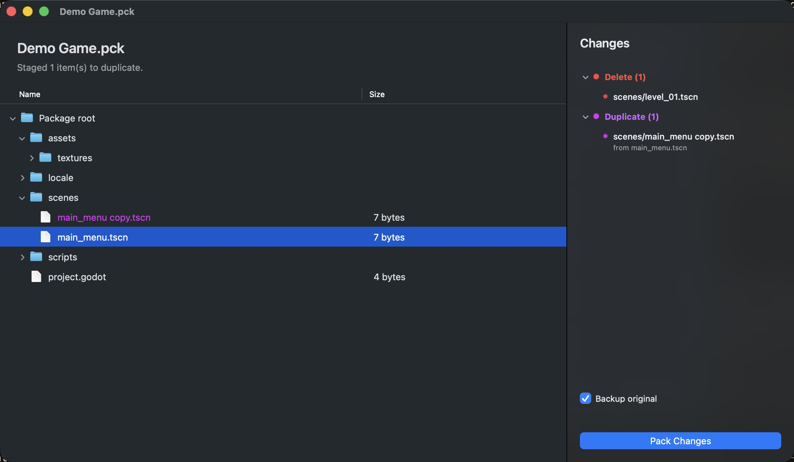

<div align="center">

# 🍶 PCK Bottle

Редактируй пакеты Godot `.pck` на macOS без командной строки.

[English](README.md) · **Русский** · [中文](README.zh.md)

[](../../releases/latest)
[](../../releases/latest)
[](LICENSE)
[](../../releases/latest)



</div>

PCK Bottle открывает игру на Godot (бандл `.app` или отдельный `.pck`) и
показывает её деревом файлов. Перетаскивай файлы внутрь, чтобы добавить или
заменить, смотри что изменилось и пакуй. Файлы из `.pck` можно и вытащить обратно
на диск. Работает с пакетами Godot 3 и Godot 4 и с любым содержимым: текстуры,
сцены, скрипты, данные `.import`, файлы локализации.

## ⬇️ Скачать

1. Открой страницу [Releases](../../releases/latest) и скачай `PCK Bottle.dmg`.
2. Открой `.dmg` и перетащи **PCK Bottle.app** в папку `Программы`.

Apple не нотаризовала эту сборку (подпись ad-hoc), поэтому при первом запуске
Gatekeeper напишет, что приложение «повреждено» или «от неизвестного
разработчика». Один раз сними карантин — и предупреждение больше не появится.

**Открой Терминал:** нажми `⌘ Пробел`, набери `Terminal`, нажми `Return`. В
открывшемся окне вставь эту строку и нажми `Return`:

```bash
xattr -dr com.apple.quarantine "/Applications/PCK Bottle.app"
```

После этого приложение открывается из Finder или Launchpad как обычно. (Правый
клик по приложению и «Открыть» тоже работает; команда в Терминале срабатывает
всегда.)

## ✨ Возможности

- Открытие игрового **`.app`** (сам находит `.pck` внутри) или отдельного **`.pck`**.
- Просмотр содержимого пакета деревом файлов.
- Перетаскивание файлов и папок для подготовки изменений. Вложенность папок
  сохраняется, а папка-обёртка вроде `translation/` распаковывается на нужные
  пути пакета.
- Сворачиваемая панель «Изменения» с группами (заменить, добавить, удалить,
  дублировать). На диск ничего не пишется до кнопки **«Запаковать»**.
- Удаление, дублирование, копирование, вставка, перетаскивание строк в Finder,
  извлечение файлов на диск.
- Отмена и повтор (⌘Z / ⇧⌘Z) для каждого изменения, с анимацией.
- Резервная копия оригинала при каждой запаковке и восстановление в любой момент.
- Упаковка как у Godot: правильный паддинг путей и выравнивание данных по формату
  (16 байт на Godot 3, 32 на Godot 4), включая скрытые папки `.import` и `.godot`
  с импортированными текстурами.
- Интерфейс на English, Русском и 中文, переключается из строки меню.
- Универсальная сборка для Intel и Apple Silicon, macOS 10.13 и новее.

## 🚀 Как пользоваться

1. Открой игру: перетащи её `.app` или `.pck` в окно, либо **Файл → Открыть**.
2. Перетащи папку мода на дерево. Для русификатора перетаскивай папку
   **`translation`**; её `scenarios/`, `UI/`, `.import/` лягут на нужные пути.
3. Проверь панель изменений, оставь **«Резервная копия оригинала»**, нажми
   **«Запаковать изменения»**.
4. Запусти игру.

### ↩️ Вернуть оригинал

С включённой галочкой **«Резервная копия оригинала»** перед каждой запаковкой
рядом с пакетом создаётся копия `<имя>.pck.<метка времени>.bak`. Откат:

- В приложении выбери **Файл → Восстановить из резервной копии…** (⇧⌘R). Вернёт
  самую свежую копию и перечитает пакет.
- Вручную удали изменённый `.pck` и переименуй самый новый `.bak` в оригинальное
  имя (`Game.pck.1700000000000.bak` становится `Game.pck`).

### 🌐 Сменить язык

Открой меню **«Язык»** в строке меню и выбери English, Русский или 中文. Выбор
запоминается, по умолчанию берётся язык системы.

## 🔧 Сборка из исходников

Нужен свежий Xcode (Swift) и Rust с обоими таргетами Apple.

```bash
rustup target add aarch64-apple-darwin x86_64-apple-darwin

# Универсальный .app (debug или release):
CONFIGURATION=release bash macos/PCKBottle/scripts/build-app.sh
# → macos/PCKBottle/build/PCK Bottle.app

# По желанию — образ диска:
bash macos/PCKBottle/scripts/make-dmg.sh

# Тесты Rust-ядра:
cargo test --manifest-path crates/pck-core/Cargo.toml
```

Сборка ремапит локальные пути и стрипает бинарники, поэтому готовый `.app` не
несёт домашнюю директорию и имя пользователя.

## 🧩 Как устроено

| Путь | Что это |
|------|---------|
| [`crates/pck-core`](crates/pck-core) | Общее **Rust**-ядро: сканирование, чтение, извлечение и атомарная переупаковка PCK. Поставляется как небольшой `pck-core-cli` внутри приложения. |
| [`macos/PCKBottle`](macos/PCKBottle) | Нативное macOS-приложение на **AppKit**, поддерживаемый продукт. |
| [`legacy/`](legacy) | Старый UI на Tauri/Vue, оставлен для справки. В сборку не входит. |

Приложение — тонкая оболочка AppKit над встроенным `pck-core-cli`, поэтому код
разбора и упаковки живёт в одном Rust-крейте.

## 📄 Лицензия

[Apache License 2.0](LICENSE).
